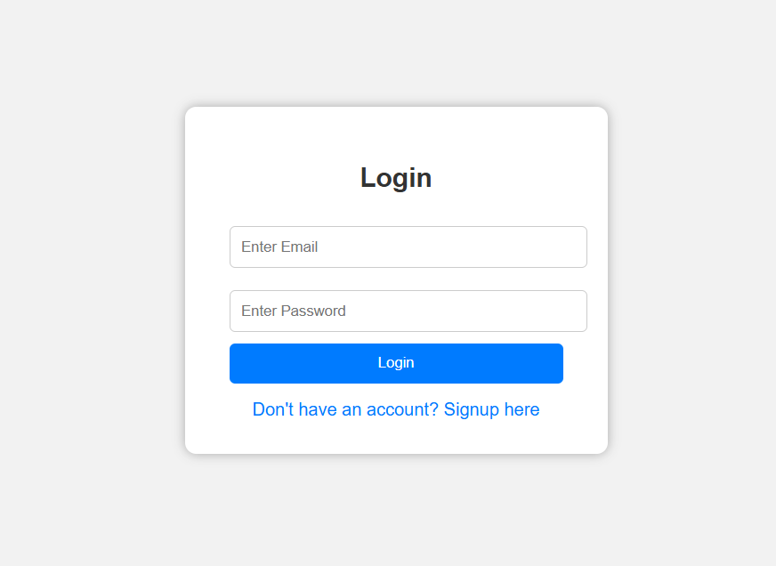

# 🕵️ Anonymous Messaging App

An interactive real-time web platform where users can **anonymously post personal messages** and receive suggestions or advice from others — without revealing their identity.

---

## 💡 What is this app?

This is a **realtime anonymous message sharing app** built using **Python Flask** and **MySQL (via XAMPP)**. Here's how it works:

- A user must **Sign up or Login** to access the platform.
- After logging in, the user can **post any personal message** anonymously.
- Other users on the platform can **see these messages** and **give suggestions**.
- **The identity of both the message poster and the suggestion giver remains hidden.**
- It works in **real-time**, and is a great platform to share personal thoughts or ask questions without judgment.

---

## 🧰 System Requirements

To run this application locally, you must have:

- ✅ Python (3.6+ recommended)
- ✅ Flask (Python micro-framework)
- ✅ XAMPP (for MySQL database)
- ✅ A modern web browser (Chrome, Firefox, etc.)
- ✅ Internet connection (for installing packages)

---

## 🔧 Setup Instructions
Follow these steps to set up the project on your local system:

### 📥 1. Clone or Download the Project

```bash
git clone [https://github.com/your-username/anonymous-messaging-app.git](https://github.com/shubhamteli9990/anonymous-confession.git)

🗃️ 2. Setup Database in XAMPP
1.Open XAMPP and start Apache and MySQL.
2.Go to http://localhost/phpmyadmin
3.Create a new database named: anon_msg_db
4.Import the SQL file from the project folder:
anonymous-messaging-app/database/anon_msg_db.sql

💻 4. Run the Flask App
1.Open Command Prompt (CMD) or Terminal.
2.Navigate to the folder where app.py is located.
  cd path/to/anonymous-messaging-app/

3.Install Flask (if not already installed):
  pip install flask
  Run the Flask app:
  python app.py
  After successful run, you'll see something like:
  Running on http://127.0.0.1:5000/
  Open the above link in your browser.

📸 Screenshots
1. login page


2. signup page 


3. user amit page


4. user aman page


👨‍💻 Features
🔒 100% Anonymous Posting
✉️ Realtime Message & Suggestion System
🧠 Helpful Community Support
👤 User Authentication (Login/Signup)
🌐 Works in Any Modern Browser


📂 Folder Structure
anonymous-messaging-app/
│
├── app.py                # Main Flask application
├── templates/            # HTML templates (Jinja2)
├── static/               # CSS, JS, Images
├── database/             # SQL file for MySQL DB
├── README.md             # Project Documentation
└── requirements.txt      # Optional: Flask dependencies


🙋 Developed by
Shubham Teli
📧 slmaratha9990@gmail.com
🌐 LinkedIn
